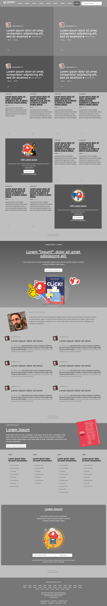

# Project Name

> This project consists of building a heatmap of the [Smashing magazine] (https://www.smashingmagazine.com/) website

In this simple project, we broke apart the website for a popular design magazine. The goal for this exercise was to start training our mindset to think in terms of visual hierarchy, typography and design principles.

## Built With

- HTML,
- CSS.

## Live Demo

[Live Demo Link](https://raw.githack.com/wrakc/smashing-magazine/feature/index.html)

## Authors

👤 **Victor Gonzalez**

- Github: [@githubhandle](https://github.com/shaqri)
- Twitter: [@twitterhandle](https://twitter.com/victorgonbu1 )
- Linkedin: [linkedin](https://www.linkedin.com/in/victor-manuel-gonzalez-buitrago-8704731a5/)

👤 **Carlos Veiga**

- Github: [@githubhandle](https://github.com/wrakc)
- Twitter: [@twitterhandle](https://twitter.com/carlosveig)
- Linkedin: [linkedin](https://linkedin.com/chveiga)

## 🤝 Contributing

Contributions, issues and feature requests are welcome!

Feel free to check the [issues page](issues/).

## Show your support

Give a ⭐️ if you like this project!

## Acknowledgments

- Thanks microverse for the support;
- Thanks minskins team;
- Thanks the-manx team;

## 📝 License

This project is [MIT](lic.url) licensed.
